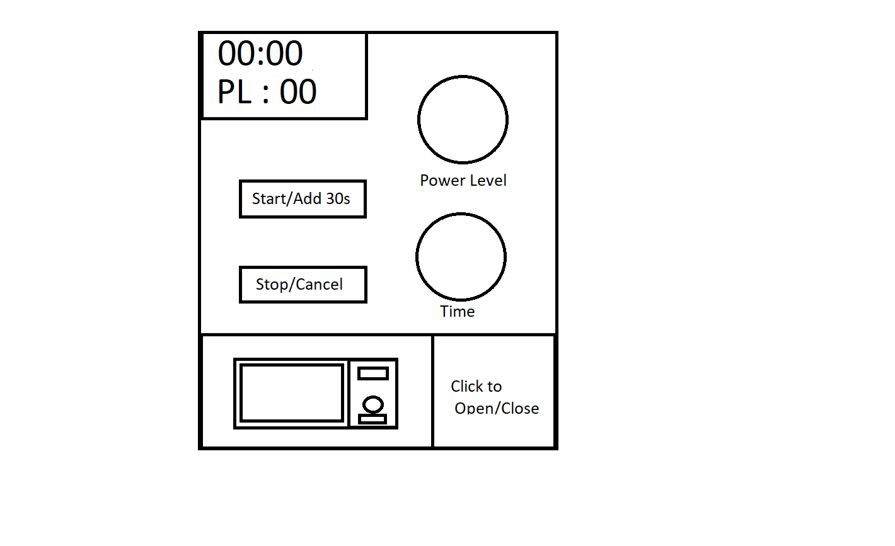

<h1>HCI CS5331 Spring 21</h1>

<h1>Aniruddh Sanjaysinh Chavda</h1>

<h2>Presentation URL</h2>
https://aniruddhchavda.github.io/p1AniruddhChavda

<h2>YouTube Link</h2>
https://youtu.be/6TCtiBeIn6s

<h1>PART C</h1>

<h2>Control Interface Picture :</h2>

<h2>Control Interface Gif :</h2>

<h2>The problems with current design :</h2>
<ul>
  <li>As shown in the gif of control interface, as soon as you select the time, it starts heating up at level 10 power by default, you cannot change the power level when the microwave is idle.</li>
  <li>Only remaining time is shown in the information panel LCD, Power Level is not displayed.</li>
  <li>The door is opened and closed manually by the User.</li>
  <li>No Support for disabled people.</li>
</ul>

<h1>PART B</h1>

<h2>Most common uses :</h2>
<ul>
  <li>Heat up the food at Medium(power level 5) for a minute.</li>
  <li>If making cake, heat up at Low(power level 2) for 15 mins.</li>
  <li>If making noodles, heat up at High(power level 10) for 4 minutes.</li>
</ul>

<h2>Rare uses :</h2>
<ul>
  <li>Auto-defrost,Time-defrost,Beverage,Potato and other pre-defined modes</li>
  <li>Setting Timer</li>
</ul>

<h2>Does the interface make doing those common things easier?</h2>

 No, Setting power level while the food is cooking results in unevenely cooked food. 

<h2>Sequence of actions :</h2>

  1) User opens the door using mechanical push button. 

  2) User opens the door using mechanical push button. 

  3) User clicks the buttons on numpad to set approriate time. 

  4) User sets the power level in 1-10 scale. 

<h2>Existing microwave's Feedback :</h2>

 The microwave makes beep sound when a button is clicked 

 The microwave makes double-beep when heating is done. 

<h2>What are some common mistakes you can make with this current design?</h2>

The most common mistake is heating up food on HIGH(Power Level 10) because it's the default Power Level when you start. It may ruin the food.

<h2>Suggestions to Improve</h2>
<ul>
<li>Make the Interface as simple as possible with minimum buttons</li>
<li>Make the Interface disable friendly.</li>
<li>Use electrically operated doors instead of mechanical button doors.</li>
<li>Make use of Human Voice to have better understanding on what's going on.</li>
</ul>

<h2>Sketch</h2>

<h1>PART A</h1>

<h2>Design for the Touch Screen</h2>

The size of the touch screen is 10 inches. Diagonal = 10 inches, Length = 8inches, Breadth = 6 inches.

<h2>Features</h2>
<ul>
<li>Click 1 button to Add 30s and heat at medium(Power level 5)</li>
<li>Support for disabled</li>
<li>Ability to set power level before cooking.</li>
<li>Electically Operated doors with auto-stop if opened.</li>
</ul>

<h2>Feedback</h2>
<ul>
<li>Whenever a button is clicked, a beep sound is played and the button will have an neon colored underline</li>
<li>While setting a knob, it's indicator will turn maroon and the value of the knob would be showed on the display in real time.</li>
<li>A human voice would be played whenever the door is opened or closed.</li>
</ul>

<h2>Support for Disabled</h2>
<ul>
  <li>Very Simple sequence of actions, just touch on left top corner to start heating at Power Level 8 for 30 secs, click again to add 30 secs more.</li>
  <li>Feedback for disabled is through human voice which will dictate the total time for cooking, remaining time and power level.</li>
</ul>

<h2>Gif of working Interface</h2>

<h1>Thank You !</h1>
